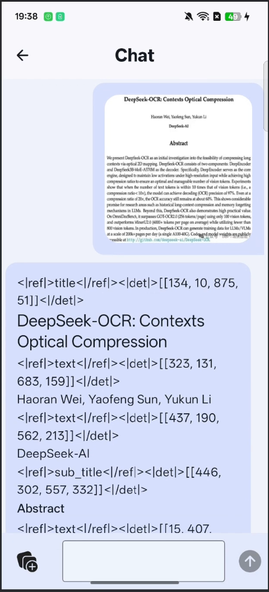
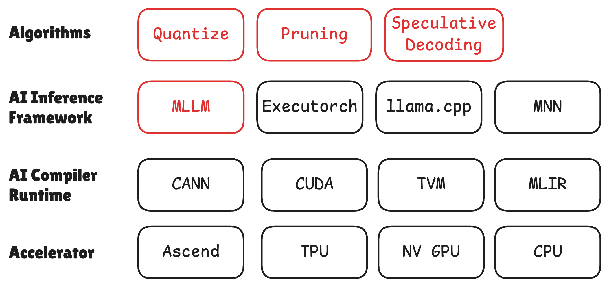
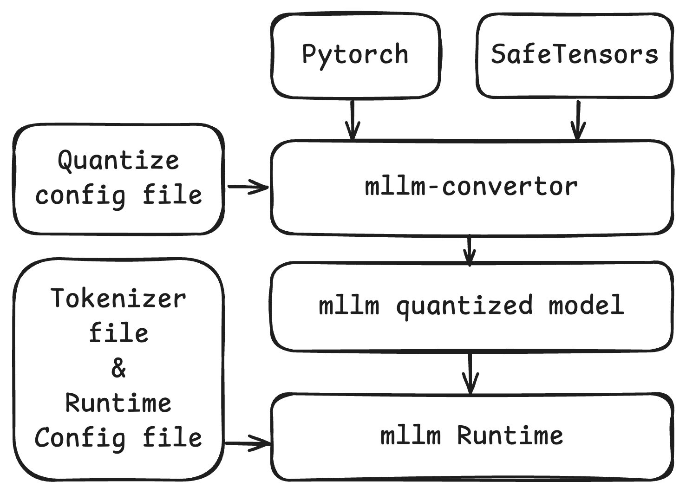

<h1 align="center">
mllm
</h1>


<div align="center">

**适用于移动端和边缘设备的快速、轻量级多模态大语言模型推理引擎**

[](https://opensource.org/licenses/MIT)
[](https://ubiquitouslearning.github.io/mllm/)
[](https://github.com/UbiquitousLearning/mllm/stargazers)

[📚 文档](https://ubiquitouslearning.github.io/mllm/) • [🚀 快速开始](#quick-starts) • [💡 示例](./examples/) • [🛠️ 安装](#installation)

</div>

## 最新动态

- [2026 年 2 月 3 日] 🔥🔥🔥 MLLM Qnn AOT 已支持在 NPU 上全图执行！[技术报告](https://chenghuawang.github.io/News/2026-01-29-mllm-qnn-aot-support/)
- [2025 年 11 月 27 日] Android Demo 更新：通过一种全新的 In-App Go 服务架构，在 Android 上实现了 Qwen3 和 DeepSeek-OCR 的稳定流式推理。
- [2025 年 11 月 23 日] MLLM v2 发布！
- [2025 年 8 月 28 日] 即将停止对 MLLM V1 的支持。在弃用前，V1 将集成以下功能：GPT-OSS。随后 MLLM 将迁移至 V2（可在 V2 分支查看）。V2 将带来全新的能力：

  - 更加 Pythonic 的模型编写方式，支持即时执行（eager execution）
  - 支持编译，便于 NPU 集成
  - 支持多模型并行执行
  - 更加完善、精细的工程实现
- [2025 年 7 月 30 日] 为 QNN 后端模型新增旋转量化（Rotation Quantization）方法，并支持 Qwen-2-VL 2B（ViT 性能分析将在 v2 中集成）

## Android Demo & Architecture

我们已对 Android 端实现进行了重构，采用了一种稳健的、完全在设备端运行的 **Client-Server** 架构。

<table width="100%">
  <tr>
    <td width="50%">
      </img>
    </td>
    <td width="50%">
      </img>
    </td>
  </tr>
</table>

不同于传统的 JNI 集成方式，我们引入了一个基于 Golang 构建的 **In-App Server** 层（`mllm_server.aar`）。该设计将 UI 与高负载的推理计算解耦。


    
## 关键特性

1. **Python 风格的即时执行（eager execution）** —— 支持快速模型开发
2. **统一的硬件支持** —— 支持 Arm CPU、OpenCL GPU、QNN NPU
3. **高级优化能力** —— 包括量化、剪枝、推测执行
4. **面向 NPU 的 IR** —— 可与 NPU 框架无缝集成
5. **部署工具链** —— 提供 SDK 与 CLI 推理工具

## MLLM 的作用

MLLM 是 AI 推理技术栈的核心枢纽。它向上连接推测解码、剪枝、量化等优化算法，向下对接用于硬件执行的 AI 编译器 / 运行时层（如 CANN、CUDA、MLIR）。图中以红色标注的 MLLM 独特地打通了算法创新与硬件优化，使其成为连接软件生态与硬件加速的关键节点。


<div align="center">
  
</div>

mllm 框架可以与主流社区框架的模型检查点无缝集成。通过 mllm-convertor，可直接导入 PyTorch 和 SafeTensors 模型，对其进行量化并转换为 mllm 格式，随后由 mllm Runtime 加载并执行。

<div align="center">
  
</div>

## 支持的模型

### mllm v2

| Model(v1)                                                                   | CPU  | Hexagon NPU <br> INT8 |
|-----------------------------------------------------------------------------|------|-----------------------|
| [Qwen3-0.6B](https://github.com/QwenLM/Qwen3)                     | [✔️ w4a8](https://www.modelscope.cn/models/mllmTeam/Qwen3-0.6B-w4a32kai)  |  | 
| [Qwen3-1.7B](https://github.com/QwenLM/Qwen3)                     | [✔️ w4a8](https://www.modelscope.cn/models/mllmTeam/Qwen3-1.7B-w4a8-i8mm-kai)  |  |
| [DeepSeek-OCR](https://github.com/deepseek-ai/DeepSeek-OCR)       | [✔️ w4a8](https://www.modelscope.cn/models/mllmTeam/DeepSeek-OCR-w4a8-i8mm-kai)  |  |
| [SmolLM3](https://huggingface.co/blog/smollm3)| [✔️ w4a8](https://www.modelscope.cn/models/mllmTeam/SmolLM3-3B-w4a8-i8mm-kai)  |  |
| [Qwen2-VL-2B-Instruct](https://qwenlm.github.io/zh/blog/qwen2-vl/)|[✔️ w4a8](https://www.modelscope.cn/models/mllmTeam/Qwen2-VL-2B-Instruct-w4a32kai) ||
| [Qwen2-VL-7B-Instruct](https://qwenlm.github.io/zh/blog/qwen2-vl/)|[✔️ w4a8](https://www.modelscope.cn/models/mllmTeam/Qwen2-VL-7B-Instruct-w4a32kai)||
| [Qwen2.5-VL-3B-Instruct](https://qwenlm.github.io/blog/qwen2.5-vl/)|[✔️ w4a8](https://www.modelscope.cn/models/mllmTeam/Qwen2.5-VL-3B-Instruct-w4a32kai)||
| [Qwen2.5-VL-7B-Instruct](https://qwenlm.github.io/blog/qwen2.5-vl/)|[✔️ w4a8](https://www.modelscope.cn/models/mllmTeam/Qwen2.5-VL-7B-Instruct-w4a32kai)||

### mllm v1

| Model(v1)                                                                       | CPU <br> FP32 | CPU <br> INT4  | Hexagon NPU <br> INT8 |
|-----------------------------------------------------------------------------|------|-----|----------------------------|
| [LLaMA 2 7B](https://github.com/facebookresearch/llama)                   | [✔️](https://huggingface.co/mllmTeam/llama-2-7b-mllm/tree/main)  | [✔️](https://huggingface.co/mllmTeam/llama-2-7b-mllm/tree/main)   |  |
| [LLaMA 3 1B](https://github.com/meta-llama/llama3)                   | [✔️](https://huggingface.co/mllmTeam/llama-3.2-1b-mllm/tree/main)  | [✔️](https://huggingface.co/mllmTeam/llama-3.2-1b-mllm/tree/main)   |  |
| [LLaMA 3 3B](https://github.com/meta-llama/llama3)                   | [✔️](https://huggingface.co/mllmTeam/llama-3.2-3b-mllm/tree/main)  | [✔️](https://huggingface.co/mllmTeam/llama-3.2-3b-mllm/tree/main)   |  |
| [Alpaca 7B](https://github.com/ymcui/Chinese-LLaMA-Alpaca-2)                | [✔️](https://huggingface.co/mllmTeam/chinese-alpaca-7b-mllm/tree/main)  | [✔️](https://huggingface.co/mllmTeam/chinese-alpaca-7b-mllm/tree/main)   |  |
| [TinyLLaMA 1.1B](https://github.com/jzhang38/TinyLlama)                     | [✔️](https://huggingface.co/mllmTeam/tinyllama-1.1b-mllm/tree/main)  | [✔️](https://huggingface.co/mllmTeam/tinyllama-1.1b-mllm/tree/main)   |  |
| [LLaVA 7B](https://github.com/haotian-liu/LLaVA)                            | [✔️](https://huggingface.co/mllmTeam/llava-1.5-7b-mllm/tree/main)  | [✔️](https://huggingface.co/mllmTeam/llava-1.5-7b-mllm/tree/main)   |  |
| [Gemma 2B](https://github.com/google/gemma_pytorch)                         | [✔️](https://huggingface.co/mllmTeam/gemma-2b-mllm/tree/main)  | [✔️](https://huggingface.co/mllmTeam/gemma-2b-mllm/tree/main)   |  |
| [Gemma 2 2B](https://github.com/google/gemma_pytorch)                         | [✔️](https://huggingface.co/mllmTeam/gemma-2-2b-mllm/tree/main)  | [✔️](https://huggingface.co/mllmTeam/gemma-2-2b-mllm/tree/main)   |  |
| [Qwen 1.5 0.5B](https://github.com/QwenLM/Qwen)                                 | [✔️](https://huggingface.co/mllmTeam/qwen-1.5-0.5b-mllm/tree/main)  | [✔️](https://huggingface.co/mllmTeam/qwen-1.5-0.5b-mllm/tree/main)   | ✔️ |
| [Qwen 1.5 1.8B](https://github.com/QwenLM/Qwen)                            | [✔️](https://huggingface.co/mllmTeam/qwen-1.5-1.8b-chat-mllm)  | [✔️](https://huggingface.co/mllmTeam/qwen-1.5-1.8b-chat-mllm)   | [✔️](https://huggingface.co/mllmTeam/qwen-1.5-1.8b-chat-mllm) |
| [Qwen 2.5 1.5B](https://github.com/QwenLM/Qwen2.5) | [✔️](https://huggingface.co/mllmTeam/qwen-2.5-1.5b-mllm/tree/main) | [✔️](https://huggingface.co/mllmTeam/qwen-2.5-1.5b-mllm/tree/main) | ✔️ |
| [Qwen 3 0.6B](https://github.com/QwenLM/Qwen3) | [✔️](https://huggingface.co/mllmTeam/qwen-3-0.6b-mllm/tree/main) | [✔️](https://huggingface.co/mllmTeam/qwen-3-0.6b-mllm/tree/main) | |
| [Mistral 7B](https://github.com/mistralai/mistral-src)                      | [✔️](https://huggingface.co/mllmTeam/mistral-7b-instruct-v0.2-mllm/tree/main)  | [✔️](https://huggingface.co/mllmTeam/mistral-7b-instruct-v0.2-mllm/tree/main)   |  |
| [Yi 6B](https://huggingface.co/01-ai/Yi-1.5-6B)                             | [✔️](https://huggingface.co/mllmTeam/yi-1.5-6b-chat-mllm/tree/main)  | [✔️](https://huggingface.co/mllmTeam/yi-1.5-6b-chat-mllm/tree/main)   |  |
| [StableLM 2 1.6B](https://github.com/Stability-AI/StableLM)                     | [✔️](https://huggingface.co/mllmTeam/stablelm-2-1.6b-chat-mllm/tree/main)  | [✔️](https://huggingface.co/mllmTeam/stablelm-2-1.6b-chat-mllm/tree/main)   |  |
| [OPT 1.3B](https://github.com/facebookresearch/metaseq/tree/main/projects/OPT)                     | [✔️](https://huggingface.co/mllmTeam/opt-1.3b-mllm/tree/main)  | [✔️](https://huggingface.co/mllmTeam/opt-1.3b-mllm/tree/main)   |  |
| [Phi 3 mini 3.8B](https://huggingface.co/microsoft/Phi-3-mini-4k-instruct)                     |  [✔️](https://huggingface.co/mllmTeam/phi-3-mini-instruct-mllm/tree/main)   | [✔️](https://huggingface.co/mllmTeam/phi-3-mini-instruct-mllm/tree/main)   |  |
| [MiniCPM 2B](https://huggingface.co/openbmb/MiniCPM-2B-dpo-fp32)                     |  [✔️](https://huggingface.co/mllmTeam/minicpm-2b-dpo-mllm/tree/main)   | [✔️](https://huggingface.co/mllmTeam/minicpm-2b-dpo-mllm/tree/main)   |  |
| [MiniCPM 3 4B](https://huggingface.co/openbmb/MiniCPM3-4B)                     |  [✔️](https://huggingface.co/mllmTeam/minicpm3-4b-mllm/tree/main)   | [✔️](https://huggingface.co/mllmTeam/minicpm3-4b-mllm/tree/main)   |  |
| [MiniCPM MoE 8x2B](https://huggingface.co/openbmb/MiniCPM-MoE-8x2B)                     |  [✔️](https://huggingface.co/mllmTeam/minicpm-moe-8x2b-mllm/tree/main)   | [✔️](https://huggingface.co/mllmTeam/minicpm-moe-8x2b-mllm/tree/main)   |  |
| [SmolLM 1.7B](https://huggingface.co/HuggingFaceTB/SmolLM-1.7B-Instruct)                     |  [✔️](https://huggingface.co/mllmTeam/smollm-1.7b-instruct-mllm/tree/main)   | [✔️](https://huggingface.co/mllmTeam/smollm-1.7b-instruct-mllm/tree/main)   |  |
| [DCLM 1B](https://huggingface.co/TRI-ML/DCLM-1B) | [✔️](https://huggingface.co/mllmTeam/dclm-1b-mllm/tree/main)| [✔️](https://huggingface.co/mllmTeam/dclm-1b-mllm/tree/main)| |
| [OpenELM 1.1B](https://github.com/apple/corenet/tree/main/projects/openelm) | [✔️](https://huggingface.co/mllmTeam/openelm-1.1b-mllm/tree/main)| [✔️](https://huggingface.co/mllmTeam/openelm-1.1b-mllm/tree/main)| |
[PhoneLM 1.5B](https://github.com/UbiquitousLearning/PhoneLM) | [✔️](https://huggingface.co/mllmTeam/phonelm-1.5b-mllm/tree/main)| [✔️](https://huggingface.co/mllmTeam/phonelm-1.5b-mllm/tree/main)| [✔️](https://huggingface.co/mllmTeam/phonelm-1.5b-mllm/tree/main)|
| [Fuyu 8B](https://www.adept.ai/blog/fuyu-8b)                                | [✔️](https://huggingface.co/mllmTeam/fuyu-8b-mllm/tree/main)  | [✔️](https://huggingface.co/mllmTeam/fuyu-8b-mllm/tree/main)   |  
| [Vision Transformer](https://github.com/google-research/vision_transformer) | [✔️](https://huggingface.co/mllmTeam/vit-base-patch16-224-mllm/tree/main)  | [✔️](https://huggingface.co/mllmTeam/vit-base-patch16-224-mllm/tree/main)   | 
| [CLIP](https://github.com/openai/CLIP)                                      | [✔️](https://huggingface.co/mllmTeam/clip-vit-base-patch32-mllm/tree/main)  | [✔️](https://huggingface.co/mllmTeam/clip-vit-base-patch32-mllm/tree/main)   |
| [ImageBind](https://github.com/facebookresearch/ImageBind) (3 modalities)   | [✔️](https://huggingface.co/mllmTeam/imagebind_huge-mllm/tree/main)  | [✔️](https://huggingface.co/mllmTeam/imagebind_huge-mllm/tree/main)   | 
| [LLaVA 7B](https://github.com/haotian-liu/LLaVA)                            | [✔️](https://huggingface.co/mllmTeam/llava-1.5-7b-mllm/tree/main)  | [✔️](https://huggingface.co/mllmTeam/llava-1.5-7b-mllm/tree/main)   |
| [Phi-3-Vision](https://huggingface.co/microsoft/Phi-3-vision-128k-instruct)                            | [✔️](https://huggingface.co/mllmTeam/phi-3-vision-instruct-mllm/tree/main)  | [✔️](https://huggingface.co/mllmTeam/phi-3-vision-instruct-mllm/tree/main)   |
| [Qwen2-VL 2B](https://github.com/QwenLM/Qwen2-VL)                            | [✔️](https://huggingface.co/mllmTeam/qwen-2-vl-2b-instruct--mllm/tree/main)  | [✔️](https://huggingface.co/mllmTeam/qwen-2-vl-2b-instruct--mllm/tree/main)   | ✔️ |

## 测试设备

| Device | OS | CPU | GPU | NPU |
| :---: | :---: | :---: | :---: | :---: |
| PC-X86-w/oAVX512  | Ubuntu 22.04  |  | - | - |
| Nvidia A40  | Ubuntu 22.04  | - |  | - |
| Xiaomi14-8Elite   | Android 15    |  | - |  |
| OnePlus13-8Elite  | Android 15    |  | - |  |
| MacMini-M4        | MacOS 15.5    |  | - | - |
| OrangePi AI Pro(310B)        | Ubuntu 22.04    | - | - |  |
| OrangePi AI Studio(310P)        | Ubuntu 22.04    | - | - |  |

## 快速开始

### 使用 mllm-cli 提供 LLM 服务

我们为 MLLM C++ SDK 开发了一个 C SDK 包装器，以实现与 Golang 的无缝集成。基于该包装器，我们用 Golang 构建了 mllm-cli 命令行工具，该工具即将发布。

### 使用 C++ API 对 VLM 进行推理

以下示例展示了如何使用 mllm 框架的 C++ API 对多模态视觉-语言模型（VLM），具体为 Qwen2-VL，进行推理。流程包括加载模型配置、初始化分词器、加载预训练权重、处理图文输入，以及执行流式文本生成。

```c++
auto qwen2vl_cfg        = Qwen2VLConfig(config_path);
auto qwen2vl_tokenizer  = Qwen2VLTokenizer(tokenizer_path);
auto qwen2vl            = Qwen2VLForCausalLM(qwen2vl_cfg);

qwen2vl.load(mllm::load(model_path));
auto inputs = qwen2vl_tokenizer.convertMessage({.prompt = prompt_text, .img_file_path = image_path});

for (auto& step : qwen2vl.chat(inputs)) { 
  std::wcout << qwen2vl_tokenizer.detokenize(step.cur_token_id) << std::flush; 
}
```

更多示例可见 [示例](./examples/)

### 自定义模型

MLLM 提供了高度 Python 风格的 API，以简化用户的模型实现。例如，下面是一个简洁的 `VisionMLP` 实现示例：

```c++
class VisionMlp final : public nn::Module {
  int32_t dim_;
  int32_t hidden_dim_;

  nn::QuickGELU act_;
  nn::Linear fc_1_;
  nn::Linear fc_2_;

 public:
  VisionMlp() = default;

  inline VisionMlp(const std::string& name, const Qwen2VLConfig& cfg) : nn::Module(name) {
    dim_ = cfg.visual_embed_dim;
    hidden_dim_ = cfg.visual_embed_dim * cfg.visual_mlp_ratio;

    fc_1_ = reg<nn::Linear>("fc1", dim_, hidden_dim_, true, cfg.linear_impl_type);
    fc_2_ = reg<nn::Linear>("fc2", hidden_dim_, dim_, true, cfg.linear_impl_type);
    act_ = reg<nn::QuickGELU>("act");
  }

  std::vector<Tensor> forward(const std::vector<Tensor>& inputs, const std::vector<AnyValue>& args) override {
    return {fc_2_(act_(fc_1_(inputs[0])))};
  }
};
```

要使用这个 `VisionMLP`，可以按如下方式实例化并执行：

```c++
auto mlp = VisionMlp(the_mlp_name, your_cfg);
print(mlp);
auto out = mlp(Tensor::random({1, 1024, 1024}));
print(out);
```

### 模型追踪

MLLM 通过其 `trace` API 支持 **计算图提取**，将动态模型执行转换为优化后的静态表示。这对于模型优化、序列化和部署非常关键。例如：

```c++
auto ir = mllm::ir::trace(mlp, Tensor::random({1, 1024, 1024})); 
print(ir);
```

## 安装

### Arm Android

```shell
pip install -r requirements.txt
python task.py tasks/build_android.yaml
```

如果需要编译 QNN 后端，请先安装 QNN SDK。有关 QNN 环境的搭建说明，请参阅 [QNN README](mllm/backends/qnn/README.md)。

环境配置完成后，可以使用以下命令编译 MLLM。


```shell
pip install -r requirements.txt
python task.py tasks/build_android_qnn.yaml
```

### X86 PC

```shell
pip install -r requirements.txt
python task.py tasks/build_x86.yaml
```

### OSX(Apple Silicon)

```shell
pip install -r requirements-mini.txt
python task.py tasks/build_osx_apple_silicon_accelerate.yaml
```

### 使用 Docker

MLLM 团队提供了 Dockerfile，帮助你快速入门，并推荐使用 Docker 镜像。在 `./docker/` 文件夹中，我们提供了 arm（交叉编译到 arm，主机为 x86）和 qnn（交叉编译到 arm，主机为 x86）镜像。ARM 和 QNN 镜像均支持 X86 后端的编译。

```shell
git clone https://github.com/UbiquitousLearning/mllm.git
cd mllm/docker
docker build -t mllm_arm -f Dockerfile.arm .
docker run -it --cap-add=SYS_ADMIN --network=host --cap-add=SYS_PTRACE --shm-size=4G --security-opt seccomp=unconfined --security-opt apparmor=unconfined --name mllm_arm_dev mllm_arm bash
```

重要说明：

1. Dockerfile.arm 包含 NDK 下载。使用此镜像即表示你同意 NDK 的附加条款。
2. QNN SDK 含有专有许可条款。我们不会将其打包在 Dockerfile.qnn 中，请手动配置 QNN SDK。

关于如何使用 Dockerfile 的详细说明，请参阅 [使用 Docker 和 DevContainer 轻松设置 MLLM](docker/README.md)

### 构建 C++ SDK

你可以使用以下命令构建 SDK：

```shell
pip install -r requirements.txt
python task.py tasks/build_sdk_<platform>.yaml
# 例如在 Apple Silicon 的 macOS 上：
python task.py tasks/build_sdk_osx_apple_silicon.yaml
```

默认情况下，SDK 会安装到 `mllm` 项目的根目录。若需自定义安装路径，可在任务的 YAML 文件中修改 `-DCMAKE_INSTALL_PREFIX` 选项。

安装完成后，可使用 `find_package(mllm)` 将该库集成到你的 CMake 项目中。下面是一个最小可用示例：

```cmake
cmake_minimum_required(VERSION 3.21)
project(fancy_algorithm VERSION 1.0.0 LANGUAGES CXX C ASM)

# 设置 C++20 标准并启用编译命令导出
set(CMAKE_CXX_STANDARD 20)
set(CMAKE_EXPORT_COMPILE_COMMANDS ON)

# 查找 mllm 库
find_package(mllm REQUIRED)

add_executable(fancy_algorithm main.cpp)

# 链接 Mllm 运行时和 CPU 后端目标
target_link_libraries(fancy_algorithm PRIVATE mllm::MllmRT mllm::MllmCPUBackend)
```

### 构建文档

你可以使用以下命令来构建文档：

```shell
pip install -r docs/requirements.txt
python task.py tasks/build_doc.yaml
```

如果你需要生成 Doxygen 文档，请确保系统已安装 Doxygen。然后，在 `tasks/build_doc.yaml` 配置文件中将 `enable_doxygen` 选项设置为 `true`。随后运行 `python task.py tasks/build_doc.yaml` 即可生成 C++ API 文档。

## 模型转换

mllm 提供了一套模型转换工具，用于将其他主流模型格式转换为 MLLM。在开始之前，请确保已安装 **pymllm**！！！

```shell
bash ./scripts/install_pymllm.sh
```

**future:**

一旦 PyPI 批准创建 mllm 组织，我们将会在上面发布该包。之后，你可以使用以下命令进行安装。

```shell
pip install pymllm
```

安装 pymllm 后，你可以使用以下命令进行模型转换：

```shell
mllm-convertor --input_path <your_model> --output_path <your_output_model> --cfg_path <your_config> --pipeline <builtin_pipeline>
```

更多使用说明，请参阅 `mllm-convertor --help`。

## 工具

### mllm-params-inspector

模型参数查看工具，用于检查模型文件的参数。

用法:

```bash
./mllm-params-inspector -i /path/to/model.mllm [-iv v1|v2] [-n param_name]
```

参数:

```text
-i, --input: 模型文件路径
-iv, --input_version: 模型文件版本 (v1 或 v2), 默认为 v1
-n, --name: 特定参数名称，仅显示该参数的信息
-h, --help: 显示帮助信息
```

示例:

```bash
# 查看模型文件中的所有参数信息
./mllm-params-inspector -i /path/to/model.mllm

# 查看特定参数信息
./mllm-params-inspector -i /path/to/model.mllm -n transformer.h.0.attn.c_attn.weight

# 查看 v2 版本模型文件
./mllm-params-inspector -i /path/to/model.mllm -iv v2
```

## 加入我们 & 贡献

mllm 社区正在不断壮大，已有开发者提交了 PR。我们对每一位关注和贡献者表示诚挚的感谢。我们已在 [Issues 页面](https://github.com/UbiquitousLearning/mllm/issues) 固定了路线图，你可以在其中找到希望贡献的功能，并通过提交 Issue 通知 mllm 社区。

mllm 源于学术探索的沃土，致力于多模态大模型的纯粹追求。然而，学术“创新”与工业“稳定”之间总存在差距。我们坦诚地承认当前的不足，并坚信社区协作的力量。无论你是研究人员、工程师还是技术爱好者，每一个 Issue、每一次 PR、每一条建议或鼓励的话语，都有助于为 mllm 打下更坚实的基础。让我们携手将这一学术起源的项目，打造为真正连接学术与工业的桥梁。

无论你专注于硬件适配、模型优化、工具开发，还是文档与生态建设，这里都有贡献的机会。我们特别期待与你合作，增强 X86 CPU 与 Ascend NPU 支持，探索前沿的量化与剪枝算法，完善更友好的工具链，并丰富开箱即用的模型库。通过社区协作，你不仅能与核心团队紧密合作，直接影响项目的发展，还能在设备端 AI 的前沿留下自己的创新印记，让 mllm 在越来越多的设备上运行。

mllm 因社区而存在，也因你而更强大。我们期待与你携手，共同开创设备端 AI 的新纪元。

## 致谢

mllm 在 ARM CPU 上复用了许多来自 [ggml](https://github.com/ggerganov/ggml) 的底层内核实现。
同时，它还利用了 [stb](https://github.com/nothings/stb) 和 [wenet](https://github.com/wenet-e2e/wenet) 进行图像和音频的预处理。
mllm 也受益于以下项目：[llama.cpp](https://github.com/ggerganov/llama.cpp) 和 [MNN](https://github.com/alibaba/MNN)。

## 许可证

### 整体项目许可证

本项目根据 MIT 许可证的条款进行许可。完整的 MIT 许可证文本请参阅根目录下的 [LICENSE](./LICENSE) 文件。

### Apache 2.0 许可组件

本项目的某些组件（[wenet](https://github.com/wenet-e2e/wenet)）根据 Apache License 2.0 进行许可。
这些组件在其各自的子目录中已明确标识，并附有 Apache License 2.0 的副本。
Apache License 2.0 的完整文本请参阅相关子目录中的 [LICENSE-APACHE](./third_party/wenet_audio/LICENSE) 文件。

## 引用

```bibtex
@article{xu2025fast,
  title={Fast On-device LLM Inference with NPUs},
  author={Xu, Daliang and Zhang, Hao and Yang, Liming and Liu, Ruiqi and Huang, Gang and Xu, Mengwei and Liu, Xuanzhe},
  booktitle={International Conference on Architectural Support for Programming Languages and Operating Systems (ASPLOS)},
  year={2025}
}
@misc{yi2023mllm,
  title = {mllm: fast and lightweight multimodal LLM inference engine for mobile and edge devices},
  author = {Rongjie Yi and Xiang Li and Zhenyan Lu and Hao Zhang and Daliang Xu and Liming Yang and Weikai Xie and Chenghua Wang and Xuanzhe Liu and Mengwei Xu},
  year = {2023},
  publisher = {mllm Team},
  url = {https://github.com/UbiquitousLearning/mllm}
}
```

## Star 历史

<a href="https://www.star-history.com/#UbiquitousLearning/mllm&Date">
 <picture>
   <source media="(prefers-color-scheme: dark)" srcset="https://api.star-history.com/svg?repos=UbiquitousLearning/mllm&type=Date&theme=dark" />
   <source media="(prefers-color-scheme: light)" srcset="https://api.star-history.com/svg?repos=UbiquitousLearning/mllm&type=Date" />
   
 </picture>
</a>
