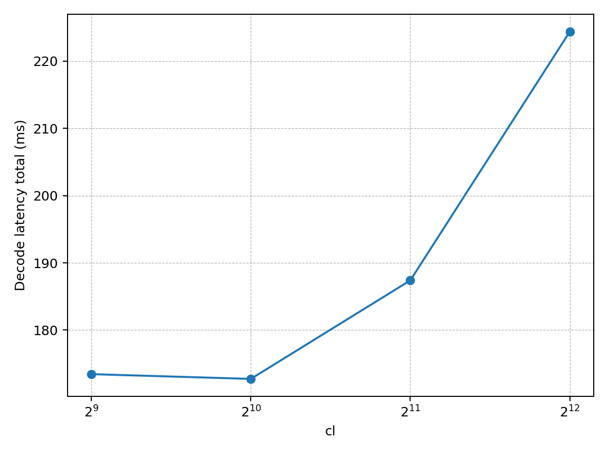
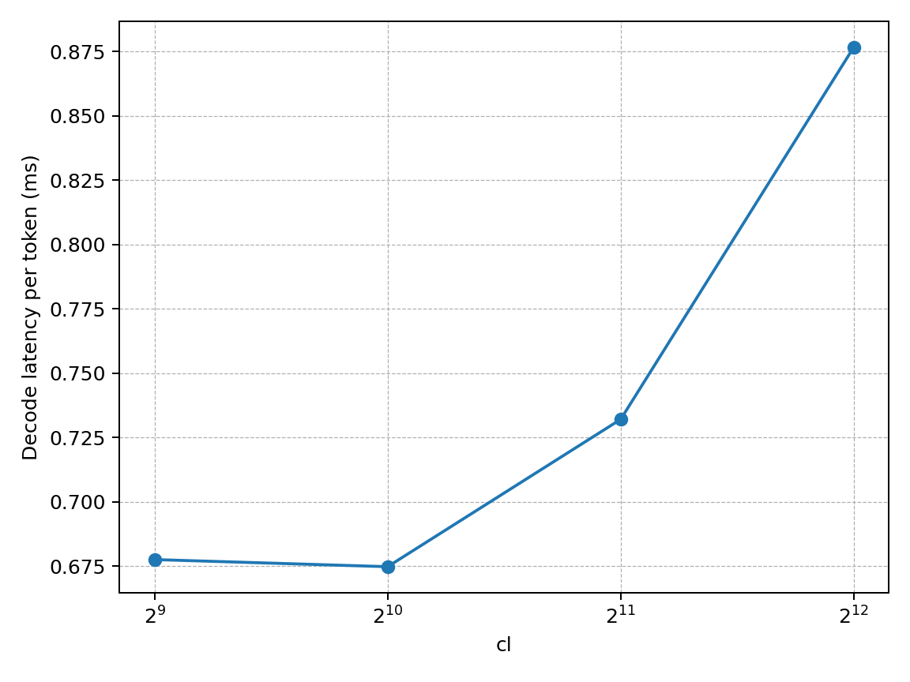
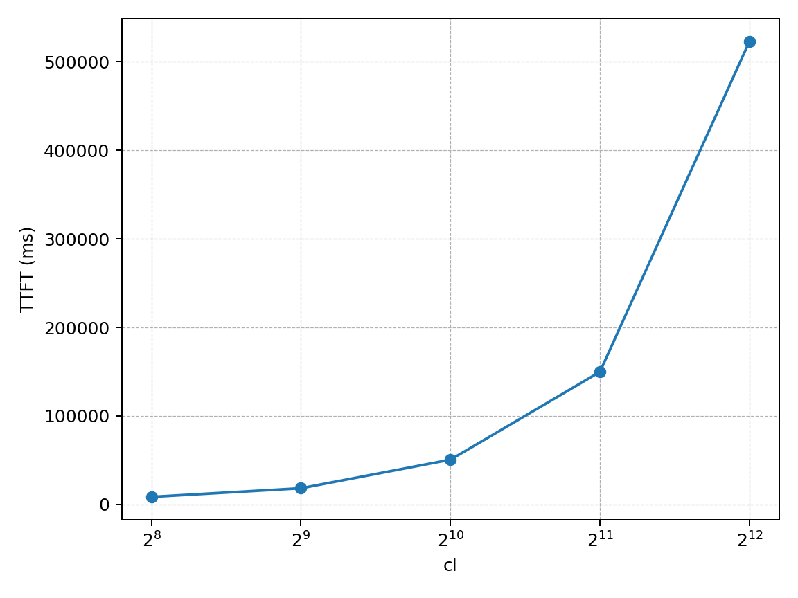
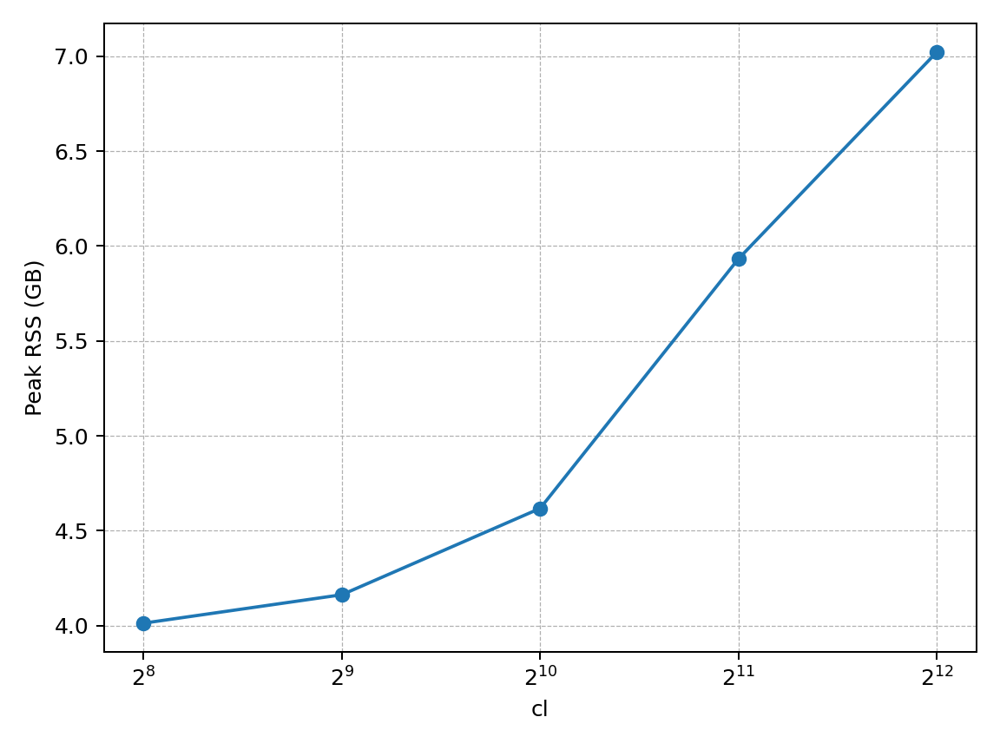
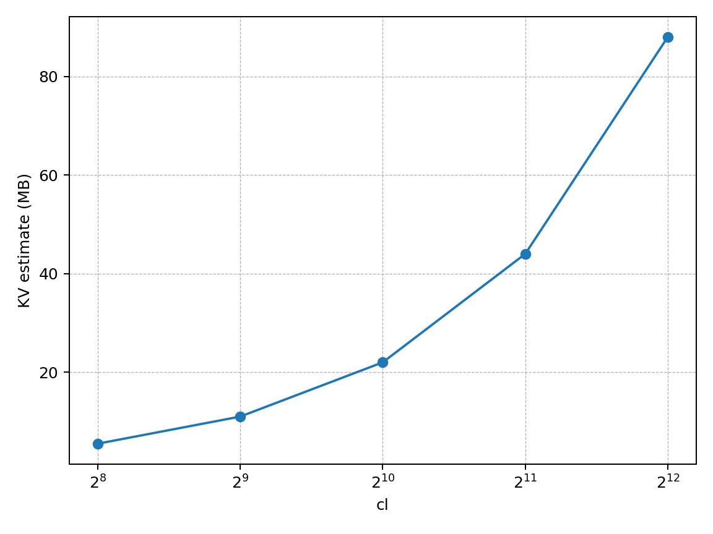

# MLLM x86 TinyLlama: Context Sweep + Perf/Shape Snapshot (TTFT & Decode)

**Punchline**  
在 x86_64（8 threads）上，TinyLlama 的 **decode per-token latency 基本维持在 ~0.67–0.88 ms/tok（cl=512→4096）**，而 **TTFT/prefill 随 context 增长呈显著上升（并在大 context 极度昂贵）**。  
Perf 显示热点高度集中在 **tinyBLAS 小分块 GEMM 模板**；shape 统计显示 decode 主要落在 **M=1/32 这类小 M 的 GEMM/SGEMM**（典型是 [M, K]×[K, N]，N=2048/5632/32000），这解释了“看起来像小矩阵乘”而不是“纯 L2 handling”的直觉差异：**算子形状/数据复用方式 + 核/缓存层级 + 实现路径**会把瓶颈显性化到 GEMM 模板上。

---

## **Core Evidence**

### **Fig.1: Decode latency vs context (ms)**

### **Fig.2: Decode per-token latency vs context (ms/tok)**

### **Fig.3: TTFT/Prefill vs context (ms)**

### **Fig.4: Memory growth (Peak RSS, GB)**

### **Fig.5: KV estimate growth (MB, formula-based)**

---

## **What perf + shape logs say**

### Perf top (decode-heavy)
- Hotspot 主要集中在 `tinyBLAS<...>::gemm<5,1>` / `gemm<4,3>` 等模板实例（小 tile GEMM）。
- 这说明 decode 阶段大量时间花在 **小 M（例如 M=1/32）** 的 GEMM 上：算子“看起来就是小矩阵乘”。

### Shape top (by FLOPs)
- decode-heavy 常见大头：`M=32,N=5632,K=2048`、`M=1,N=5632,K=2048`、以及 `N=2048/32000` 等。
- prefill（大 PP）阶段会出现 `M=512,N=5632,K=2048` 这种更“像大矩阵”的形状。

---

## **3 Strategic Takeaways**

1. **Bottleneck statement (data-driven):**  
   decode 的热点高度集中在 tinyBLAS 小 tile GEMM 模板；随着 context 增长，decode per-token 变化不大，但 TTFT/prefill 急剧增长，说明“长 context 的主要痛点在 prefill 侧”。

2. **Implication for static-graph / IR (minimum needs):**  
   - **shape bucketing**：把主要 GEMM 形状（N=2048/5632/32000、M=1/32/512）做 bucket，保证复用与 codegen 稳定性。  
   - **graph reuse**：decode 的主链（Linear/GEMM + 轻量算子）重复度高，适合 capture/复用。  
   - **memory planning**：peak RSS 随 context 增长明显，需要在 IR 侧暴露可复用 buffer/arena 的策略位点。

3. **Next step (toward mergeable deliverable):**  
   把（a）context sweep 脚本 +（b）固定字段 CSV +（c）snapshot 图与结论 +（d）perf/shape 的复现命令一起作为 PR 交付，后续再补“模块粗分”和“更精确的 KV/peak RSS 统计口径”。

---

*Raw CSV + plots are in bench_artifacts/.*
