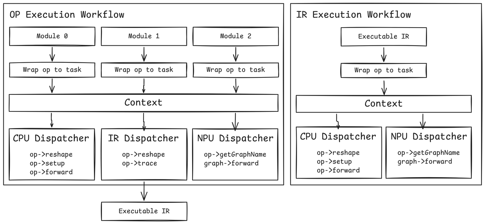

MLLM Framework Core Architecture
===================================

Overview
--------

The MLLM framework employs a hierarchical execution model with three main components:

* **Module**: High-level abstraction for neural network modules
* **Layer**: Abstraction for individual operations/layers  
* **Dispatcher**: Execution engine for different backends

This architecture supports both regular operation execution and intermediate representation (IR) tracing workflows, enabling flexible deployment across multiple hardware backends including CPU, QNN (also: Qualcomm AI Engine Direct/QAIRT), and custom accelerators.

   Figure 1: MLLM Framework Core Architecture.

Core Components
---------------

Module
~~~~~~~

The ``Module`` class serves as the top-level container for neural network components. Key responsibilities include:

* **Hierarchical Organization**: Modules can contain other modules and layers, forming a tree structure
* **Parameter Management**: Loading and saving model parameters from/to files
* **Device Management**: Moving modules and their components across different devices
* **Forward Execution**: Orchestrating the execution flow through child components

**Key Methods:**

.. code-block:: cpp

    class Module {
        std::vector<Tensor> forward(const std::vector<Tensor>& inputs, 
                                   const std::vector<AnyValue>& args);
        void to(DeviceTypes device_type);
        void load(const ParameterFile::ptr_t& param_file);
        
        // Named module registration (similar to PyTorch's named_modules)
        template<typename T, typename... Args>
        auto reg(const std::string& name, Args&&... args);
    };

**Named Module Registration:**

The ``reg()`` method provides functionality similar to PyTorch's ``named_modules()``, enabling hierarchical module organization with automatic name management in C++:

.. code-block:: cpp

    class MyModel : public nn::Module {
    public:
        MyModel(const std::string& name) : nn::Module(name) {
            // Register sub-modules with names
            encoder_ = reg<EncoderModule>("encoder", config);
            decoder_ = reg<DecoderModule>("decoder", config);
            
            // Register layers with names
            linear1_ = reg<nn::Linear>("fc1", 768, 3072, false);
            linear2_ = reg<nn::Linear>("fc2", 3072, 768, false);
        }
        
    private:
        EncoderModule encoder_;  // Absolute name: "model.encoder"
        DecoderModule decoder_;  // Absolute name: "model.decoder"
        nn::Linear linear1_;     // Absolute name: "model.fc1"
        nn::Linear linear2_;     // Absolute name: "model.fc2"
    };

**Key Features:**

* **Automatic Name Hierarchy**: Constructs fully-qualified names (e.g., ``"model.encoder.layer0.attention"``)
* **Parameter Mapping**: Links module names to parameter files for loading/saving
* **Device Management**: Enables selective device placement by module name
* **Type Safety**: Template-based registration with compile-time type checking

**Comparison with PyTorch:**

.. code-block:: python

    # PyTorch
    class MyModel(nn.Module):
        def __init__(self):
            super().__init__()
            self.encoder = EncoderModule()  # Automatically named "encoder"
            self.decoder = DecoderModule()  # Automatically named "decoder"
    
    # Print all named modules
    for name, module in model.named_modules():
        print(f"{name}: {module}")

.. code-block:: cpp

    // MLLM Framework
    class MyModel : public nn::Module {
    public:
        MyModel(const std::string& name) : nn::Module(name) {
            encoder_ = reg<EncoderModule>("encoder");  // Explicitly named "encoder"
            decoder_ = reg<DecoderModule>("decoder");  // Explicitly named "decoder"
        }
    };
    
    // Names are automatically constructed: "model.encoder", "model.decoder"
    // Used for parameter loading: params->load("model.encoder.weight")

The ``reg()`` method bridges the gap between Python's dynamic attribute naming and C++'s static type system, providing a clean API for building hierarchical neural networks.

Layer Abstraction
~~~~~~~~~~~~~~~~~

The ``Layer`` class represents individual operations or layers within a module:

* **Operation Encapsulation**: Wraps backend-specific operations (BaseOp)
* **Device Abstraction**: Handles operation instantiation for different backends
* **Task Creation**: Creates execution tasks for the dispatcher system

**Key Methods:**

.. code-block:: cpp

    class Layer {
        std::vector<Tensor> __main(const std::vector<Tensor>& inputs);
        Layer& to(DeviceTypes device_type);
        OpTypes opType() const;
    };

Dispatcher System
~~~~~~~~~~~~~~~~~

The dispatcher system provides backend-specific execution engines:

**CPUDispatcher**
  Handles CPU-based operation execution with full operation lifecycle:
  
  * ``reshape()``: Tensor shape computation
  * ``setup()``: Operation initialization  
  * ``forward()``: Actual computation

**IRTraceDispatcher**
  Captures execution traces for IR generation:
  
  * Records operation calls and tensor flows
  * Enables graph optimization and analysis
  * Supports compilation workflows

**QNNDispatcher**
  Manages QNN backend execution:
  
  * Specialized for QNN graph execution
  * Handles module-level execution for QNN graphs
  * Selective operation execution (X2X, Embedding ops)

Execution Workflows
-------------------

Op Execution Workflow
~~~~~~~~~~~~~~~~~~~~~~

The standard execution path for neural network inference:

.. code-block:: text

    Module::forward()
        │
        ├─── Module::__main()
        │    │
        │    ├─── Task::createExecuteModuleTask()
        │    │
        │    └─── DispatcherManager::submit()
        │         │
        │         └─── [CPU|QNN]Dispatcher::receive()
        │              │
        │              └─── [CPU|QNN]Dispatcher::process()
        │
        └─── Layer::__main()
             │
             ├─── Task::createExecuteOpTask()
             │
             └─── DispatcherManager::submit()
                  │
                  └─── [CPU|QNN]Dispatcher::receive()
                       │
                       └─── [CPU|QNN]Dispatcher::process()
                            │
                            ├─── Op::reshape()
                            ├─── Op::setup()
                            └─── Op::forward()

**Execution Flow Details:**

1. **Module Entry**: ``Module::forward()`` is called with input tensors
2. **Task Creation**: Creates ``kExecuteModule`` or ``kExecuteOp`` tasks
3. **Dispatcher Selection**: Routes to appropriate backend dispatcher based on device type
4. **Backend Processing**: Dispatcher executes the operation using backend-specific logic
5. **Result Return**: Output tensors are returned through the task system

IR Execution Workflow
~~~~~~~~~~~~~~~~~~~~~~

When trace mode is enabled, the framework captures an intermediate representation:

.. code-block:: text

    Module::forward() [trace_mode=true]
        │
        ├─── Module::__trace()
        │    │
        │    ├─── IRContext::create<CallGraphOp>()
        │    ├─── IRContext::create<SubGraphOp>()
        │    │
        │    ├─── Module::forward() [recursive]
        │    │
        │    └─── IRContext::create<ReturnOp>()
        │
        └─── Layer::__main() [trace_mode=true]
             │
             ├─── Task::createExecuteOpTask()
             │    └─── task->custom_context_ptr = ir_context
             │
             └─── IRTraceDispatcher::receive()
                  │
                  └─── IRTraceDispatcher::process()
                       │
                       ├─── Op::reshape()
                       └─── Op::trace()

**IR Workflow Details:**

1. **Trace Initialization**: ``Context::thisThread()->trace_mode`` enables IR capture
2. **Graph Construction**: Creates IR graph nodes (``CallGraphOp``, ``SubGraphOp``)
3. **Operation Tracing**: Each operation call is recorded in the IR graph
4. **Graph Completion**: ``ReturnOp`` finalizes the subgraph structure
5. **IR Output**: Complete computational graph is available for optimization/compilation

For more details on IR tracing and compilation, refer to the :doc:`MLLM IR <../compile/ir>` section.

Synchronous vs Asynchronous Execution
--------------------------------------

Synchronous Execution
~~~~~~~~~~~~~~~~~~~~~

Currently, the primary execution mode uses synchronous task processing:

.. code-block:: cpp

    // In Dispatcher::receive()
    void CPUDispatcher::receive(const Task::ptr_t& task) {
        process(task);  // Blocks until completion
    }

**Characteristics:**

* **Blocking Operation**: Each task completes before returning
* **Simple Flow Control**: Sequential execution guarantees
* **Immediate Results**: Output tensors available immediately after task submission

Asynchronous Execution (Future Enhancement)
~~~~~~~~~~~~~~~~~~~~~~~~~~~~~~~~~~~~~~~~~~~~

The framework includes infrastructure for asynchronous execution:

.. code-block:: cpp

    // In Dispatcher::asyncReceive() 
    TaskResult::sender_t CPUDispatcher::asyncReceive(const Task::ptr_t& task) {
        auto scheduler = thread_pool_.get_scheduler();
        return stdexec::schedule(scheduler) | 
               stdexec::then([this, task] { process(task); });
    }

**Design Features:**

* **Non-blocking Submission**: Tasks return immediately with a sender/future
* **Thread Pool Integration**: Uses ``exec::static_thread_pool`` for parallel execution
* **Sender/Receiver Pattern**: Based on C++26 sender/receiver async model
* **Pipeline Capability**: Enables operation pipelining and overlapping

**Current Status:**

The asynchronous execution path is implemented but not fully integrated:

* ``IRTraceDispatcher::asyncReceive()`` returns an error
* Most dispatchers have placeholder async implementations
* Synchronization points (``syncWait()``) are not fully implemented

Task System Architecture
-------------------------

The task system provides a unified interface for operation execution:

**Task Types:**

* ``kExecuteOp``: Single operation execution
* ``kExecuteModule``: Module-level execution (for QNN graphs)

**Task Structure:**

.. code-block:: cpp

    struct Task {
        TaskTypes type;
        BaseOp::ptr_t op;                    // Operation to execute
        std::vector<Tensor> inputs;          // Input tensors
        std::vector<Tensor> outputs;         // Output tensors
        std::vector<AnyValue> args;          // Additional arguments
        void* custom_context_ptr;            // Backend-specific context
    };

**Dispatcher Interface:**

.. code-block:: cpp

    class Dispatcher {
        virtual void receive(const Task::ptr_t& task) = 0;
        virtual TaskResult::sender_t asyncReceive(const Task::ptr_t& task) = 0;
        virtual void process(const Task::ptr_t& task) = 0;
        virtual void syncWait() = 0;
    };

Backend Integration
-------------------

The framework supports multiple execution backends through the dispatcher pattern:

**CPU Backend**
  * Full operation support with reshape/setup/forward lifecycle
  * Direct tensor computation on CPU
  * Perfetto tracing integration for performance analysis

**QNN Backend** 
  * Optimized execution for Qualcomm Neural Processing Units
  * Graph-level execution for improved performance
  * Selective operation fallback to CPU when needed

**IR Tracing Backend**
  * Captures computational graphs for analysis and optimization
  * Enables ahead-of-time compilation workflows
  * Supports graph transformation and optimization passes

This architecture provides a flexible foundation for deploying neural networks across diverse hardware platforms while maintaining a consistent programming interface.