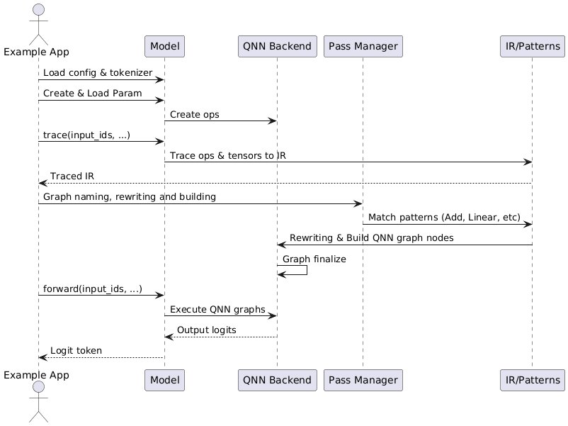

QNN Backend Design
====================

Overview
--------

The QNN (Qualcomm Neural Network) Backend provides optimized execution of neural network models on Qualcomm's AI Engine Direct (formerly SNPE/QNN SDK). This backend enables efficient deployment on Qualcomm-powered devices including smartphones, embedded systems, and edge AI platforms.

**Key Features:**

* **Hardware Acceleration**: Leverages Qualcomm's Hexagon DSP and HTP (Hexagon Tensor Processor)
* **Graph-Level Optimization**: Executes entire subgraphs as optimized QNN graphs
* **Mixed Precision Support**: INT8/INT16 quantization with dynamic scale propagation
* **Context Caching**: Serializes compiled graphs to binary format for fast loading
* **Custom Operations**: Extensible custom op support through QNN op packages

   Figure 1: QNN Backend Execution Sequence.

Architecture Components
-----------------------

The QNN backend architecture consists of several key components working together:

.. code-block:: text

    ┌─────────────────────────────────────────────────────────────┐
    │                    MLLM Framework                           │
    │  ┌──────────────┐  ┌──────────────┐  ┌──────────────┐       │
    │  │   Module     │  │    Layer     │  │  Dispatcher  │       │
    │  └──────┬───────┘  └────-─┬───────┘  └──────┬───────┘       │
    └─────────┼─────────────────┼─────────────────┼───────────────┘
              │                 │                 │
              └─────────────────┴─────────────────┘
                                │
    ┌──────────────────────────────────────────────────────────────┐
    │              QNN Backend Infrastructure                      │
    │                                                              │
    │  ┌────────────────────────────────────────────────────────┐  │
    │  │              QNNBackend (Core Manager)                 │  │
    │  │  - Runtime Management  - Context Management            │  │
    │  │  - Graph Registry      - Tensor Management             │  │
    │  └─────────┬──────────────────────────────────────────────┘  │
    │            │                                                 │
    │  ┌─────────┴──────────┬──────────────┬─────────────────┐     │
    │  │                    │              │                 │     │
    │  ▼                    ▼              ▼                 ▼     │
    │  QNNRuntime       QNNModel     QNNDispatcher    QNNGraphBuildPass
    │  (SDK Interface)  (Graph Mgmt) (Execution)      (Compilation)│
    │                                                              │
    └────────────────────────────┬─────────────────────────────────┘
                                 │
    ┌────────────────────────────▼──────────────────────────────────┐
    │              Qualcomm QNN SDK                                 │
    │  ┌──────────────┐  ┌──────────────┐  ┌──────────────┐         │
    │  │ QNN Interface│  │  QNN Context │  │  QNN Graph   │         │
    │  └──────────────┘  └──────────────┘  └──────────────┘         │
    │                                                               │
    │  ┌──────────────────────────────────────────────────────┐     │
    │  │         Hardware Backends (HTP/DSP)                  │     │
    │  └──────────────────────────────────────────────────────┘     │
    └───────────────────────────────────────────────────────────────┘

QNNBackend: Core Manager
~~~~~~~~~~~~~~~~~~~~~~~~~

The ``QNNBackend`` class serves as the central orchestrator for QNN operations:

**Responsibilities:**

* **Runtime Initialization**: Manages QNN SDK initialization and device configuration
* **Context Management**: Creates and maintains QNN execution contexts
* **Graph Registry**: Maps graph names to ``QNNModel`` instances
* **Tensor Management**: Handles tensor creation, quantization, and data transfer
* **Performance Tuning**: Configures power profiles and performance settings

**Key Methods:**

.. code-block:: cpp

    class QNNBackend : public Backend {
        // Graph lifecycle management
        std::shared_ptr<QNNModel> createQnnGraph(const std::string& graphName);
        bool graphFinalize(const std::string& graphName);
        void graphExecute(const std::string& graphName, 
                         std::vector<Tensor>& inputs,
                         std::vector<Tensor>& outputs);
        
        // Tensor management
        bool addTensor(const std::string& graphName, 
                      const std::string& tensorName,
                      Qnn_TensorType_t type, 
                      const Tensor& tensor,
                      Qnn_QuantizeParams_t quantize);
        
        // Component access
        const QNN_INTERFACE_VER_TYPE& qnnInterface() const;
        Qnn_BackendHandle_t backendHandle() const;
        Qnn_ContextHandle_t context() const;
    };

QNNRuntime: SDK Interface Layer
~~~~~~~~~~~~~~~~~~~~~~~~~~~~~~~~

Manages low-level QNN SDK initialization and resource lifecycle:

**Components:**

* **Interface Loading**: Dynamically loads QNN library symbols
* **Backend Selection**: Initializes appropriate backend (HTP/DSP/GPU)
* **Device Management**: Configures device-specific settings
* **Logging & Profiling**: Optional debug and performance profiling

**Initialization Flow:**

.. code-block:: cpp

    // Create runtime with profiling
    auto runtime = QNNRuntime::create(
        ProfilingLevel::BASIC,     // Enable profiling
        QNN_LOG_LEVEL_WARN         // Set log level
    );
    
    // Create execution context
    Qnn_ContextHandle_t context;
    runtime->createContext(context);

QNNModel: Graph Management
~~~~~~~~~~~~~~~~~~~~~~~~~~~

Represents a single QNN computational graph with complete lifecycle management:

**Graph Lifecycle:**

1. **Initialization**: Create graph with name and configuration
2. **Tensor Addition**: Register input/output/intermediate tensors
3. **Node Addition**: Add QNN operations with parameters
4. **Finalization**: Compile and optimize the graph
5. **Execution**: Run inference with input data

**Key Operations:**

.. code-block:: cpp

    class QNNModel {
        // Initialization
        ModelError_t initialize(const Qnn_ContextHandle_t& context,
                               const char* graphName,
                               bool debug);
        
        // Tensor management
        ModelError_t addTensor(const std::string& tensorName,
                              Qnn_TensorType_t type,
                              const Tensor& tensor,
                              Qnn_QuantizeParams_t quantize);
        
        ModelError_t addStaticTensor(const std::string& tensorName,
                                    const Tensor& tensor,
                                    Qnn_QuantizeParams_t quantize);
        
        std::shared_ptr<QNNTensorWrapper> getTensorWrapper(
            const std::string& tensorName);
        
        // Node management
        ModelError_t addNode(Qnn_OpConfigVersion_t version,
                            const std::string& name,
                            const std::string& packageName,
                            const std::string& type,
                            const std::vector<...>& tensorParams,
                            const std::vector<...>& scalarParams,
                            const std::vector<std::string>& inputNames,
                            const std::vector<std::string>& outputNames);
        
        // Finalization and execution
        ModelError_t finalizeGraph(Qnn_ProfileHandle_t profileHandle,
                                  Qnn_SignalHandle_t signalHandle);
        
        bool isGraphFinalized() const;
    };

**Tensor Wrappers:**

The backend uses C++ RAII wrappers to manage QNN's C-style resources:

* ``QNNTensorWrapper``: Manages tensor metadata and data buffers
* ``QNNParamTensorWrapper``: Wraps constant tensor parameters
* ``QNNParamScalarWrapper``: Wraps scalar parameters

QNNDispatcher: Execution Engine
~~~~~~~~~~~~~~~~~~~~~~~~~~~~~~~~

Handles task execution routing between CPU and QNN:

**Execution Strategy:**

.. code-block:: cpp

    void QNNDispatcher::process(const Task::ptr_t& task) {
        switch (task->type) {
            case TaskTypes::kExecuteOp: {
                // Selective execution: only X2X and Embedding on QNN
                task->op->reshape(task->inputs, task->outputs);
                if (task->op->getOpType() == OpTypes::kX2X || 
                    task->op->getOpType() == OpTypes::kEmbedding) {
                    task->op->setup(task->inputs, task->outputs);
                    task->op->forward(task->inputs, task->outputs);
                }
                break;
            }
            case TaskTypes::kExecuteModule: {
                // Full module execution on QNN
                auto qnnBackend = getBackend(kQNN);
                auto moduleName = getModuleName(task);
                
                // Forward pass to populate outputs
                task->outputs = module->forward(task->inputs, task->args);
                
                // Execute the QNN graph
                qnnBackend->graphExecute(moduleName, 
                                        task->inputs, 
                                        task->outputs);
                break;
            }
        }
    }

**Execution Modes:**

* **Op-Level**: Individual operations (X2X, Embedding) executed separately
* **Module-Level**: Entire subgraphs executed as optimized QNN graphs

QNNGraphBuildPass: Compilation Pipeline
~~~~~~~~~~~~~~~~~~~~~~~~~~~~~~~~~~~~~~~~

Transforms MLLM IR into executable QNN graphs through pattern matching:

**Compilation Flow:**

1. **IR Traversal**: Iterate through ``SubGraphOp`` nodes marked for QNN
2. **Pattern Matching**: Match MLLM operations to QNN operation patterns
3. **Graph Construction**: Build QNN graph with nodes and tensors
4. **Optimization**: Apply QNN SDK optimizations
5. **Finalization**: Compile graph for target hardware

**Pattern Registration:**

.. code-block:: cpp

    class QNNGraphBuildPass : public Pass {
        QNNGraphBuildPass() {
            // Register operation patterns
            regPattern<QNNAddPattern, 
                      QNNMulPattern,
                      QNNLinearPattern,
                      QNNRMSNormPattern,
                      QNNViewPattern,
                      QNNTransposePattern,
                      QNNX2XPattern,
                      QNNCastTypePattern,
                      QNNSiLUPattern>();
            
            // Register custom ops
            patterns_.emplace(
                customOpId("DequantizeAdd"),
                std::make_shared<QNNDequantizeAddPattern>()
            );
        }
    };

**Pattern Example:**

.. code-block:: cpp

    class QNNLinearPattern : public QNNOpPattern {
        bool addNode(const std::string& graphName,
                    const ir::linalg::LinalgIROp::ptr_t& op,
                    const std::vector<TensorValue::ptr_t>& inputs,
                    const std::vector<TensorValue::ptr_t>& outputs) override {
            // Add input tensors
            addTensor(graphName, inputs[0], QNN_TENSOR_TYPE_NATIVE);
            addTensor(graphName, inputs[1], QNN_TENSOR_TYPE_STATIC);
            
            // Add output tensor
            addTensor(graphName, outputs[0], QNN_TENSOR_TYPE_NATIVE);
            
            // Create QNN FullyConnected node
            backend->graphAddNode(
                graphName,
                op->name(),
                "FullyConnected",
                {inputs[0]->name(), inputs[1]->name()},
                {outputs[0]->name()},
                {}, // tensor params
                {}  // scalar params
            );
            
            return true;
        }
    };

Execution Workflows
-------------------

Compilation Workflow
~~~~~~~~~~~~~~~~~~~~

The QNN backend compilation workflow transforms traced IR into executable graphs:

.. code-block:: text

    User Model (Python/C++)
            │
            ├─── Model::trace()  [trace_mode=true]
            │    └─── Creates IR representation
            │
            ▼
    IR Module (mllm::ir::ModuleOp)
            │
            ├─── Contains SubGraphOp(s) marked as DeviceTypes::kQNN
            │
            ▼
    QNNGraphBuildPass::run()
            │
            ├─── For each QNN SubGraphOp:
            │    │
            │    ├─── backend->createQnnGraph(graphName)
            │    │    └─── Creates QNNModel instance
            │    │
            │    ├─── Add graph input tensors
            │    │    └─── qnnModel->addTensor(..., QNN_TENSOR_TYPE_APP_WRITE)
            │    │
            │    ├─── Traverse IR operations
            │    │    │
            │    │    ├─── Match to QNN patterns
            │    │    │    └─── pattern->addNode(graphName, op, inputs, outputs)
            │    │    │
            │    │    └─── Create QNN ops with:
            │    │         ├─── Tensor parameters (weights, constants)
            │    │         ├─── Scalar parameters (hyperparameters)
            │    │         ├─── Input tensor names
            │    │         └─── Output tensor names
            │    │
            │    └─── backend->graphFinalize(graphName)
            │         │
            │         ├─── qnnModel->finalizeGraph(...)
            │         │    └─── Calls qnnInterface.graphFinalize()
            │         │         └─── QNN SDK optimizes and compiles graph
            │         │
            │         └─── Graph ready for execution
            │
            ▼
    Compiled QNN Graphs (ready for inference)

**Code Example:**

.. code-block:: cpp

    // In QNNGraphBuildPass::buildQnnGraph()
    void QNNGraphBuildPass::buildQnnGraph(
        const ir::graph::SubGraphOp::ptr_t& sub_graph_op) {
        
        auto qnn_backend = getQNNBackend();
        std::string graph_name = sub_graph_op->getSymbolAttr()->str();
        
        // Create QNN model
        auto qnn_model = qnn_backend->createQnnGraph(graph_name);
        
        // Add graph inputs
        for (auto& input : sub_graph_op->inputs()) {
            auto input_tensor = input->cast_<TensorValue>();
            auto quantize_param = createQuantizeParams(input_tensor->tensor_);
            qnn_model->addTensor(input_tensor->name(), 
                                QNN_TENSOR_TYPE_APP_WRITE,
                                input_tensor->tensor_,
                                quantize_param);
        }
        
        // Process operations
        for (auto& region_op : graph_region->ops()) {
            if (auto linalg_op = cast<LinalgIROp>(region_op)) {
                auto op_types = linalg_op->getAOpTypes();
                if (patterns_.contains(op_types)) {
                    patterns_[op_types]->addNode(
                        graph_name, linalg_op, 
                        op_inputs, op_outputs
                    );
                }
            }
        }
        
        // Finalize graph
        qnn_backend->graphFinalize(graph_name);
    }

Runtime Execution Workflow
~~~~~~~~~~~~~~~~~~~~~~~~~~~

Standard inference execution through the dispatcher system:

.. code-block:: text

    Application::forward()
            │
            ├─── Module::forward()  [DeviceTypes::kQNN]
            │    │
            │    ├─── Module::__main()
            │    │    │
            │    │    ├─── Task::createExecuteModuleTask()
            │    │    │    └─── task->custom_context_ptr = module
            │    │    │
            │    │    └─── DispatcherManager::submit(qnn_dispatcher_id, task)
            │    │
            │    ▼
            QNNDispatcher::receive(task)
            │    │
            │    └─── QNNDispatcher::process(task)
            │         │
            │         ├─── case kExecuteModule:
            │         │    │
            │         │    ├─── Extract module name
            │         │    │
            │         │    ├─── Call module->forward() to setup outputs
            │         │    │    └─── Creates output tensor shapes
            │         │    │
            │         │    └─── qnnBackend->graphExecute(moduleName, inputs, outputs)
            │         │         │
            │         │         ├─── Lookup QNNModel by name
            │         │         │
            │         │         ├─── Copy input data to QNN tensors
            │         │         │    └─── Handles quantization if needed
            │         │         │
            │         │         ├─── qnnInterface.graphExecute()
            │         │         │    └─── QNN SDK executes on HTP/DSP
            │         │         │
            │         │         └─── Copy output data from QNN tensors
            │         │              └─── Handles dequantization if needed
            │         │
            │         └─── case kExecuteOp:
            │              └─── Execute X2X/Embedding ops individually
            │
            ▼
    Output Tensors (returned to application)

Quantization Support
--------------------

The QNN backend provides comprehensive quantization support for efficient inference:

Quantization Metadata Management
~~~~~~~~~~~~~~~~~~~~~~~~~~~~~~~~~

Quantization scales are attached to tensors as metadata:

.. code-block:: cpp

    // Set quantization scale
    inline void setQuantScale(Tensor& tensor, float scale) {
        auto scale_view = std::make_shared<TensorView>(
            Tensor::empty({1}, kFloat32, kCPU).alloc()
        );
        scale_view->ptr<float>()[0] = scale;
        tensor.attachedViews()[QNN_QUANT_SCALE_NAME] = scale_view;
    }
    
    // Get quantization scale
    inline float getQuantScale(Tensor& tensor) {
        if (!tensor.attachedViews().contains(QNN_QUANT_SCALE_NAME)) {
            return 1.0f;  // Default scale
        }
        return tensor.attachedViews()[QNN_QUANT_SCALE_NAME]->ptr<float>()[0];
    }

QNN Quantization Parameters
~~~~~~~~~~~~~~~~~~~~~~~~~~~~

Convert MLLM quantization to QNN format:

.. code-block:: cpp

    Qnn_QuantizeParams_t createQuantizeParams(const Tensor& tensor) {
        if (tensor.dtype() == kInt8 || tensor.dtype() == kInt16) {
            float scale = getQuantScale(tensor);
            return Qnn_QuantizeParams_t{
                QNN_DEFINITION_DEFINED,
                QNN_QUANTIZATION_ENCODING_SCALE_OFFSET,
                {.scaleOffsetEncoding = {
                    .scale = scale,
                    .offset = 0  // Zero-point offset
                }}
            };
        }
        // Undefined quantization for float tensors
        return DEFAULT_QUANTIZE_PARAMS;
    }

Scale Propagation
~~~~~~~~~~~~~~~~~

Quantization scales propagate through reshape operations:

.. code-block:: cpp

    void propagateQuantScale(const Tensor& input, Tensor& output) {
        if (input.dtype() == kInt8 || input.dtype() == kInt16) {
            float scale = getQuantScale(input);
            setQuantScale(output, scale);
        }
    }

Custom Operations
-----------------

The QNN backend supports custom operations through the QNN Op Package mechanism:

DequantizeAdd Custom Op
~~~~~~~~~~~~~~~~~~~~~~~~

A custom fused operation combining dequantization and addition:

**Purpose:**

* Fuse int8 dequantization with element-wise addition
* Improve accuracy for quantized models

**Usage Example:**

.. code-block:: cpp

    // In QwenAttentionProjNPU
    class QwenAttentionProjNPU : public nn::Module {
        nn::qnn::DequantizeAdd q_proj_dequantize_add_;
        nn::qnn::DequantizeAdd k_proj_dequantize_add_;
        nn::qnn::DequantizeAdd v_proj_dequantize_add_;
        
        QwenAttentionProjNPU(const std::string& name, const QwenNPUConfig& cfg) 
            : nn::Module(name) {
            // Register custom ops
            q_proj_dequantize_add_ = reg<nn::qnn::DequantizeAdd>(
                "self_attn.q_proj_dequantize_add"
            );
            // ...
        }
    };

**Pattern Registration:**

.. code-block:: cpp

    // In QNNGraphBuildPass constructor
    patterns_.emplace(
        Context::instance().lookupCustomizedOpId(kQNN, "DequantizeAdd"),
        std::make_shared<QNNDequantizeAddPattern>()
    );

Performance Optimization
------------------------

Power Configuration
~~~~~~~~~~~~~~~~~~~

The QNN backend provides power profile management:

.. code-block:: cpp

    class QNNPerf {
        void setPowerConfigBurst() {
            // High performance mode
            // - Maximum clock frequencies
            // - Higher power consumption
            // - Lower latency
        }
        
        void setPowerConfigBalanced() {
            // Balanced mode
            // - Moderate clock frequencies
            // - Balanced power/performance
            // - Medium latency
        }
        
        void setRpcLatencyAndPolling() {
            // Configure RPC latency for HTP communication
        }
    };

Profiling Support(TODO)
~~~~~~~~~~~~~~~~~~~~~~~

.. note:: This is not yet implemented. Better profiling info printing should be added.

Enable detailed profiling for performance analysis:

.. code-block:: cpp

    enum class ProfilingLevel {
        OFF,       // No profiling
        BASIC,     // Basic timing information
        DETAILED,  // Detailed layer-wise profiling
        INVALID
    };
    
    // Create runtime with profiling
    auto runtime = QNNRuntime::create(
        ProfilingLevel::DETAILED,
        QNN_LOG_LEVEL_INFO
    );

Context Serialization
~~~~~~~~~~~~~~~~~~~~~

.. note:: TODO: Context retrieve should support retrieve by file name and dynamic switching.

Serialize compiled graphs to avoid recompilation:

.. code-block:: cpp

    // Save context to binary file
    qnn_backend->saveContext("qnn_context.bin");
    
    // Load pre-compiled context
    Qnn_ContextHandle_t context;
    std::vector<std::shared_ptr<QNNModel>> models;
    runtime->retrieveContext(context, models);

Best Practices
--------------

Graph Partitioning
~~~~~~~~~~~~~~~~~~

For optimal performance, partition your model strategically:

**Guidelines:**

* **QNN Subgraphs**: Place compute-intensive operations (Linear, Conv, Attention)
* **CPU Operations**: Keep dynamic operations (KVCache, RoPE) on CPU
* **Minimize Data Transfer**: Reduce tensor copies between QNN and CPU

**Example Partitioning:**

.. code-block:: cpp

    class QwenDecoder : public Module {
        // QNN: Attention projections
        QwenAttentionProjNPU self_attn_proj_;  // -> kQNN
        
        // CPU: KV cache and RoPE
        QwenAttentionMatmul self_attn_matmul_; // -> kCPU
        
        // QNN: Output projection and MLP
        QwenOutProjAndMLP self_attn_out_mlp_;  // -> kQNN
    };

Quantization Strategy
~~~~~~~~~~~~~~~~~~~~~

**Recommendations:**

1. **Per-Tensor Quantization**: Attach scales to input/output tensors
2. **Scale Initialization**: Set scales during model loading
3. **Dynamic Range**: Use calibration data to determine optimal scales
4. **Precision**: INT8 for most operations, INT16 for critical layers

.. code-block:: cpp

    // During model loading
    void loadQuantizedModel(const ParameterFile::ptr_t& params) {
        for (auto& [name, tensor] : *params) {
            if (tensor.dtype() == kInt8) {
                // Scale stored in parameter file
                float scale = params->getScale(name);
                setQuantScale(tensor, scale);
            }
        }
    }

Error Handling
~~~~~~~~~~~~~~

Always check return codes from QNN operations:

.. code-block:: cpp

    #define CALL_QNN(apiCall) do {                                       \
        int errorCode = ((apiCall) & 0xFFFF);                            \
        if (errorCode != QNN_SUCCESS) {                                  \
            MLLM_ERROR("QNN Error in {}, line {}: error code {}",        \
                      __FILE__, __LINE__, errorCode);                    \
            assert(errorCode == QNN_SUCCESS);                            \
        }                                                                \
    } while (0)
    
    // Usage
    CALL_QNN(qnnInterface.graphFinalize(graph, nullptr, nullptr));

Troubleshooting
---------------

Common Issues
~~~~~~~~~~~~~

**Issue: Graph finalization fails**

* **Cause**: Incompatible tensor dimensions or unsupported operations
* **Solution**: Check QNN SDK documentation for supported ops and constraints

**Issue: Incorrect output values**

* **Cause**: Quantization scale mismatch or missing scale propagation
* **Solution**: Verify quantization scales are correctly set and propagated

**Issue: Performance degradation**

* **Cause**: Excessive CPU-QNN data transfers or suboptimal partitioning
* **Solution**: Profile with Perfetto, optimize graph boundaries

Debug Logging
~~~~~~~~~~~~~

Enable verbose QNN logging:

.. code-block:: cpp

    auto runtime = QNNRuntime::create(
        ProfilingLevel::DETAILED,
        QNN_LOG_LEVEL_VERBOSE  // Maximum verbosity
    );

API Reference
-------------

QNNBackend API
~~~~~~~~~~~~~~

.. code-block:: cpp

    class QNNBackend : public Backend {
    public:
        // Graph lifecycle
        std::shared_ptr<QNNModel> createQnnGraph(const std::string& graphName);
        bool graphFinalize(const std::string& graphName);
        void graphExecute(const std::string& graphName,
                         std::vector<Tensor>& inputs,
                         std::vector<Tensor>& outputs);
        
        // Tensor management
        bool addTensor(const std::string& graphName,
                      const std::string& tensorName,
                      Qnn_TensorType_t type,
                      const Tensor& tensor,
                      Qnn_QuantizeParams_t quantize = DEFAULT_QUANTIZE_PARAMS);
        
        bool addStaticTensor(const std::string& graphName,
                            const std::string& tensorName,
                            const Tensor& tensor,
                            Qnn_QuantizeParams_t quantize = DEFAULT_QUANTIZE_PARAMS);
        
        std::shared_ptr<QNNTensorWrapper> getTensorWrapper(
            const std::string& graphName,
            const std::string& tensorName);
        
        // Node management
        void graphAddNode(const std::string& graphName,
                         const std::string& nodeName,
                         const std::string& nodeType,
                         const std::vector<std::string>& inputTensorNames,
                         const std::vector<std::string>& outputTensorNames,
                         const std::vector<std::shared_ptr<QNNParamTensorWrapper>>& tensorParams,
                         const std::vector<std::shared_ptr<QNNParamScalarWrapper>>& scalarParams,
                         const std::string& packageName = "qti.aisw");
        
        // Properties
        bool isWeightOnDevice() override;
        const QNN_INTERFACE_VER_TYPE& qnnInterface() const;
        Qnn_BackendHandle_t backendHandle() const;
        Qnn_ContextHandle_t context() const;
    };

For more information on the overall framework architecture, see :doc:`../arch/arch`.

