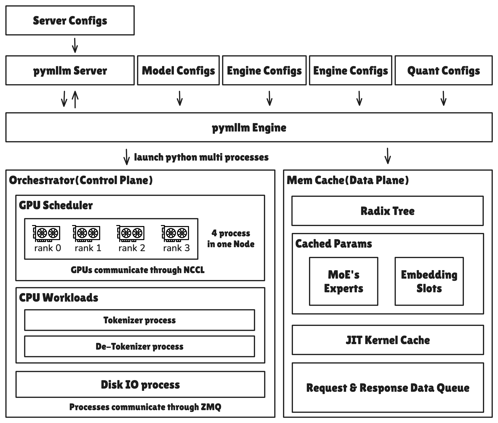

# pymllm



`pymllm` 是 `mllm` 的 Python 推理服务入口。本目录当前重点覆盖
Jetson Orin 上的 Qwen3 / Qwen3-VL 推理、OpenAI-compatible server、
`compressed-tensors` 量化加载，以及 W8A8 INT8 kernel 路径。

本文档按 2026-04-27 的开发状态整理，适用于当前集成分支：

```text
feature/jetson-qwen3-family-bf16-w4a16-w8a8
```

## 当前状态

已验证路径：

- `Qwen3-VL-2B-Instruct`：BF16 原生模型服务可用。
- `Qwen3-VL-2B-Instruct-AWQ-4bit`：`compressed-tensors`
  W4A16 / AWQ Marlin 路径可用。
- `Qwen3-VL-2B-Instruct-quantized.w8a8`：`compressed-tensors`
  W8A8 `int-quantized` 路径端到端可用。

已实现并纳入单元测试的模型/组件：

- `Qwen3VLForConditionalGeneration`：图文模型服务主路径。
- `Qwen3ForCausalLM`：文本模型骨架、权重加载与 timing 字段测试。
- `compressed-tensors`：
  - `pack-quantized` 4-bit 权重路径，使用 GPTQ Marlin。
  - `int-quantized` W8A8 路径，使用 Triton 激活量化 + CUTLASS
    `int8_scaled_mm`。

W8A8 当前前向链路：

```text
x(fp16/bf16)
  -> per_token_quant_int8        [Triton, dynamic per-token activation quant]
  -> int8_scaled_mm              [CUTLASS, INT8 Tensor Core, fused scales]
  -> output(fp16/bf16)
```

## 已验证环境

以下命令基于 Jetson Orin 环境整理：

- JetPack / L4T：`R36.4.4`（来自 `/etc/nv_tegra_release`）
- Python：`3.10.12`
- PyTorch：`2.4.0`
- torchvision：`0.19.0a0+48b1edf`
- transformers：`5.3.0`
- safetensors：`0.7.0`
- flashinfer：`0.6.7`
- Triton Language：官方 PyPI `triton==3.6.0` manylinux aarch64 wheel
- CUDA：`12.6`
- GPU：Jetson Orin NX，SM87

这里的 Triton 指 GPU kernel DSL，不是 Triton Inference Server。Jetson-AI-Lab
源也提供 `3.4.0`、`3.5.1`、`3.6.0`，但实测中可能需要额外设置
`TRITON_PTXAS_PATH` 和 `CPATH`。当前建议优先使用官方 PyPI 的
`triton==3.6.0`，并用最小 CUDA kernel 或 `per_token_quant_int8` 做 smoke test。

W8A8 CUTLASS JIT 需要能找到 CUTLASS 头文件。当前查找顺序为：

1. `CUTLASS_HOME/include`
2. `flashinfer` 内置的 `data/cutlass/include`
3. `/usr/local/include`、`/usr/include`、`/usr/local/cuda/include`

首次调用 CUTLASS kernel 会触发 JIT 编译，耗时约 100 秒；后续会复用：

```text
~/.cache/mllm_kernel/cutlass_int8_scaled_mm/
```

## 安装开发环境

在仓库根目录执行：

```bash
cd <repo-root>
SKBUILD_WHEEL_CMAKE=false python3 -m pip install -e .
python3 -m pip install -e <repo-root>/mllm-kernel --no-deps --no-build-isolation
```

最小导入检查：

```bash
python3 - <<'PY'
import pymllm
import mllm_kernel

print("pymllm import ok")
print("mllm_kernel import ok")
PY
```

## 启动服务

### 量化模型（W4A16 / W8A8）

```bash
cd <repo-root>

python3 -m pymllm.server.launch \
  --server.model_path <quantized-model-path> \
  --server.tokenizer_path <quantized-model-path> \
  --server.load_format safetensors \
  --server.dtype float16 \
  --quantization.method compressed-tensors \
  --server.host 0.0.0.0 \
  --server.port 30000 \
  --server.attention_backend auto \
  --server.gdn_decode_backend pytorch \
  --server.mem_fraction_static 0.05 \
  --server.max_running_requests 1 \
  --server.max_total_tokens 256 \
  --server.max_prefill_tokens 128 \
  --server.chunked_prefill_size 128 \
  --server.disable_radix_cache \
  --server.disable_cuda_graph \
  --server.log_level debug
```

说明：

- `--quantization.method compressed-tensors` 会按模型 `config.json`
  自动识别 W4A16 或 W8A8 签名。
- W8A8 路径要求 GPU capability 不低于 SM80。
- `--server.disable_radix_cache` 会使用 `ChunkCache`，当前已修复该模式下的
  KV slot 泄漏问题。
- 若 `30000` 已被占用，可改成其他空闲端口。

### BF16 原生模型

```bash
cd <repo-root>

python3 -m pymllm.server.launch \
  --server.model_path <model-path> \
  --server.tokenizer_path <model-path> \
  --server.load_format safetensors \
  --server.dtype float16 \
  --server.host 0.0.0.0 \
  --server.port 30000 \
  --server.attention_backend auto \
  --server.gdn_decode_backend pytorch \
  --server.mem_fraction_static 0.05 \
  --server.max_running_requests 1 \
  --server.max_total_tokens 256 \
  --server.max_prefill_tokens 128 \
  --server.chunked_prefill_size 128 \
  --server.disable_radix_cache \
  --server.disable_cuda_graph \
  --server.log_level debug
```

## 调用示例

### 健康检查

```bash
curl -s --noproxy '*' http://127.0.0.1:30000/v1/models ; echo
```

期望返回中包含：

```text
"owned_by":"pymllm"
```

### 文本请求

```bash
curl -s --noproxy '*' http://127.0.0.1:30000/v1/chat/completions \
  -H "Content-Type: application/json" \
  -d '{
    "model": "None",
    "messages": [{"role": "user", "content": "你好，只回复：ok"}],
    "max_tokens": 8,
    "temperature": 0.0,
    "stream": false
  }' ; echo
```

### 图文请求

图片路径请使用容器内可访问的绝对路径，不要使用 `file://...` 前缀。

```bash
python3 - <<'PY'
import json

payload = {
    "model": "None",
    "messages": [
        {
            "role": "user",
            "content": [
                {"type": "text", "text": "请详细描述这张图片。"},
                {"type": "image_url", "image_url": {"url": "/workspace/xcd_mllm/test.png"}},
            ],
        }
    ],
    "max_tokens": 128,
    "temperature": 0.0,
    "stream": False,
}

with open("/tmp/mm_req_path.json", "w", encoding="utf-8") as f:
    json.dump(payload, f, ensure_ascii=False)

print("saved /tmp/mm_req_path.json")
PY

curl -s --noproxy '*' http://127.0.0.1:30000/v1/chat/completions \
  -H "Content-Type: application/json" \
  --data @/tmp/mm_req_path.json ; echo
```

## 开发与测试

常用单元测试：

```bash
pytest pymllm/tests/test_compressed_tensors_config.py -q
pytest pymllm/tests/test_compressed_tensors_runtime.py -q
pytest pymllm/tests/test_qwen3_model_registry.py -q
pytest pymllm/tests/test_qwen3_weight_loading.py -q
pytest pymllm/tests/test_qwen3_forward_timing.py -q
pytest mllm-kernel/tests/test_int8_scaled_mm_cutlass.py -q
```

常用 microbench：

```bash
python3 pymllm/tests/bench_w8a8_activation_quant.py
python3 mllm-kernel/benchmarks/bench_int8_scaled_mm.py
python3 mllm-kernel/benchmarks/bench_w4a16_vs_w8a8.py
```

如果需要重新测 CUTLASS 首次编译，可先清理 JIT 缓存：

```bash
rm -rf ~/.cache/mllm_kernel/cutlass_int8_scaled_mm/
```

## 已知限制

- W8A8 CUTLASS 当前通过 JIT 编译，首次启动存在约 100 秒编译开销。
- W8A8 激活量化使用 Triton kernel；decode 下固定量化开销仍是后续优化点。
- Qwen3-VL 的 ViT、`lm_head`、embedding 和 LayerNorm 不在当前 W8A8 量化范围内。
- 其他 GPU 需要重新验证 tile dispatch、JIT 编译和性能。
- 服务侧 timing 字段适合观察整体请求链路；严格模型级计时应使用专用 benchmark。
