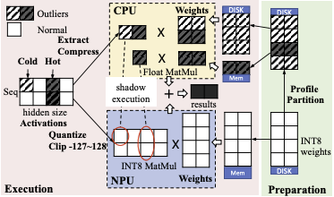

# Profiling Activation Tools

The profiling activation tools are used to get quantized **W8A8** model used by **QNN backend**. This dircetory contains the following files:
- get_act_distribution.py: get activation distribution config
- eval_quantize_threshold.py: evaluate the quantization threshold(number of clipped layers)
- export_int8_model.py: export quantized .pth model with int8 weights, quantization scales and clipped layers information
- simulate_inference.py: simulate inference with quantized model

## Supported Model Type
- transformers.models.qwen2
- transformers.models.llama
- transformers.models.opt
- transformers.models.gemma
- transformers.models.phi
- transformers.models.mixtral
- transformers.models.falcon

## Design
We have designed a W8A8 quantization algorithm called **'Shadow Outlier Execution'** that selectively retains the precision of certain layers by sampling outlier layers and applying a threshold-based selection. This approach accelerates computation on low-precision data for NPUs while minimizing accuracy loss.



It extracts the activation channels with outliers at runtime into a more compact tensor, executes it on CPU, and merges it back to the outcome of original operator on NPU.

It will go through following steps:

1. Profile a large corpora at offline 
2. Determine an outlier threshold by the profling result, thereby identifying the outliers by simply comparing the activation numbers to this threshold.
3. Export int8 pytorch model and convert to mllm model file


## Usage

Get activation distribution config using `tools/convertor/profiling_activation/get_act_distribution.py`.

```bash
# You can download the validation dataset of the Pile at https://huggingface.co/datasets/mit-han-lab/pile-val-backup/resolve/main/val.jsonl.zst
python get_act_distribution.py --model_name <path_to_hf_repo or your local path> --dataset pile-val-backup/val.jsonl.zst --output_file act_scales_distribution.json
```
**Caution: getting activation distribution config needs huge amount of (cpu) memory and will take more than 1 hour. Memory Volume > 100 GB  is suggested.**

Use the activation distribution config to predict in different threshold of clipping. It will determine the number and the position of no_clip layers(shadow layers in modeling, see `src/models/qwen/modeling_qwen_npu.hpp`).

```bash
python eval_quantize_threshold.py --model_name <model_name> --model_type ["llama", "qwen1", "qwen2", "gemma", "phi", "opt", "mixtral", "falcon"] --scale_file <generated_distribution_config>
```

Export the int8 weight model with shadow layers config and static quantization scale.

```bash
python export_int8_model.py --model_name <model_name> --model_type  ["llama", "qwen1", "qwen2", "gemma", "phi", "opt", "mixtral", "falcon"] --scale_file <generated_distribution_config> --output_model <output_model_name>
```

Convert the .pth model to mllm model using `tools/convertor/converter.py`.

```bash
python converter.py --input_model <exported_pth_model> --output_model output_model.mllm
```