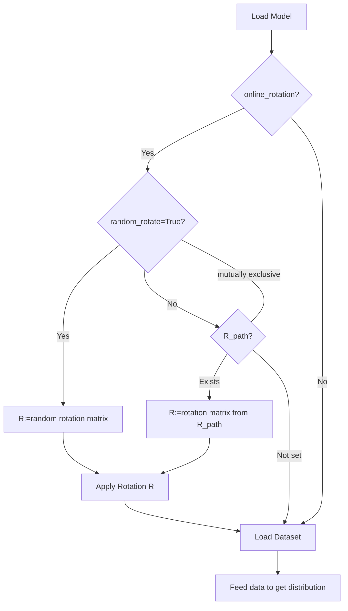
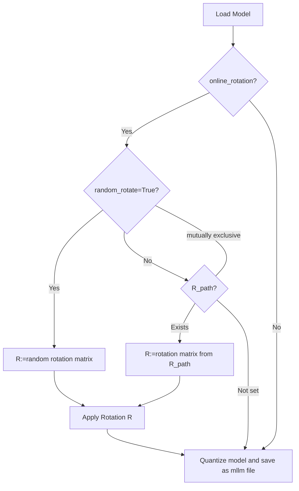

# MLLM QNN Convertor

## Profile model
Currently, QNN only supports static quantization, which means we need to collect the activation distributions of every layer offline.

Use following command to get distribution of a specific model
```bash
python get_distribution.py --config_file config/qwen1.5-1.8b.json
```

Two example configs are provided in the config directory for `qwen1.5-1.8b` and `showui-2b`.

Currently, we support the following model types: `qwen2` and `qwen2-vl`.

The activation scale information will be saved to the `output_file`, and the randomly generated rotation matrix will be saved to the `save_rotation` file.

Note that `online_rotation` should be set to true if we are going to convert an original model that has not been rotated. Otherwise, `online_rotation` should be set to false.

The schema of the config file is:
```python
{
    "type": "object",
    "required": ["profile_config", "export_config"],
    "additionalProperties": False,

    "properties": {
        "profile_config": {
            "type": "object",
            "required": [
                "dataset_path", "output_path", "num_samples", "no_bias", "model_config"
            ],
            "additionalProperties": False,

            "properties": {
                "dataset_path": {"type": "string"}, # which dataset to use for profiling
                "output_path":  {"type": "string"}, # where to save the profiling results
                "num_samples":  {"type": "integer", "minimum": 2}, # number of samples to use in dataset to profile
                "no_bias":      {"type": "boolean"}, # if true, we will ignore bias when profiling a linear layer. that is, for a linear layer Wx + b, we will only record the output scale of Wx.

                "model_config": {
                    "type": "object",
                    "required": [
                        "model_type", # currently only support qwen2 and qwen-vl(this is qwen2-vl, not qwen2.5-vl. you can refer to model_interface.py for details)
                        "tokenizer_name", # path to tokenizer
                        "model_name",     # path to model
                    ],
                    "additionalProperties": True,

                    "properties": {
                        "model_type":     {"type": "string"},
                        "tokenizer_name": {"type": "string"},
                        "model_name":     {"type": "string"},
                        "online_rotation": {"type": "boolean"}, # rotate after loading model
                        "random_rotate":   {"type": "boolean"}, # generate random rotation matrix and use it to rotate the model
                        "save_rotation":   {"type": "string"},  # this is the path to save the rotation matrix
                        "R_path": {"type": "string"} # if online_rotation is true, rotation matrix from R_path will be used to rotate the model. The random_rotate and  R_path are mutually exclusive
                    }
                }
            }
        },

        "export_config": {
            "type": "object",
            "required": [
                "scale_file", "output_model", "model_config"
            ],
            "additionalProperties": False,

            "properties": {
                "scale_file":        {"type": "string"},
                "output_model":      {"type": "string"},
                "t01m_clip_threshold": {"type": "integer"},
                "quant_bias":        {"type": "boolean"},
                "clip_all":          {"type": "boolean"}, # if true, t01m_clip_threshold will not be effected

                "quantize_vit":      {"type": "boolean"}, # if true, we will quantize vit model

                "model_config": {
                    "type": "object",
                    "required": [
                        "model_type",
                        "tokenizer_name",
                        "model_name",
                    ],
                    "additionalProperties": True,

                    "properties": {
                        "model_type":     {"type": "string"},
                        "tokenizer_name": {"type": "string"},
                        "model_name":     {"type": "string"},
                        "online_rotation": {"type": "boolean"},
                        "random_rotate":   {"type": "boolean"},
                        "save_rotation":   {"type": "string"},
                        "R_path": {"type": "string"} # R_path and random_rotate are mutually exclusive
                    }
                }
            }
        }
    }
}
```

The flowchart of the profiling process is shown below



## Export QNN Model

Use the following command to export a QNN-compatible model:

```bash
python export_qnn_model.py --config_file config/qwen1.5-1.8b.json
```

## Export FP32 Rotated Model

You can also use the following command to export an FP32 rotated model that can be converted to an MLLM CPU model:

```bash
python export_rotate_model.py --config_file config/qwen1.5-1.8b.json
```

This will export a rotated model in FP32 format that maintains the full precision while applying the rotation transformations.

The flowchart of exporting process is shown below



## Workflow Summary

1. **Profile activation scales**: Run `get_distribution_wobias.py` to collect activation statistics and generate rotation matrices
2. **Export quantized model**: Run `export_qnn_model.py` to create a quantized model for QNN deployment
3. **Export FP32 rotated model**: Run `export_rotate_model.py` to create an FP32 rotated model for CPU deployment
4. **Convert to MLLM format**: Use the standard MLLM convertor tools to generate the final deployment model
